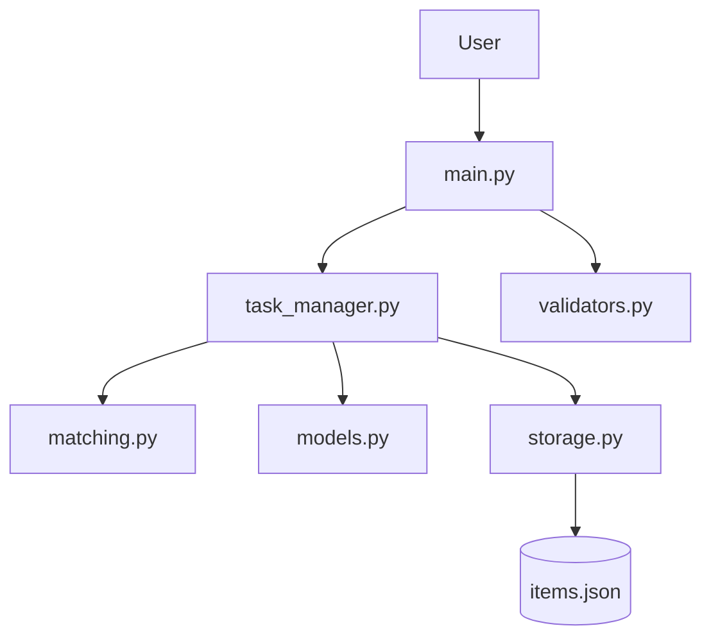
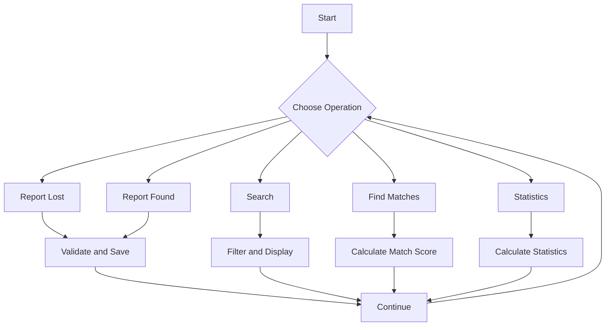
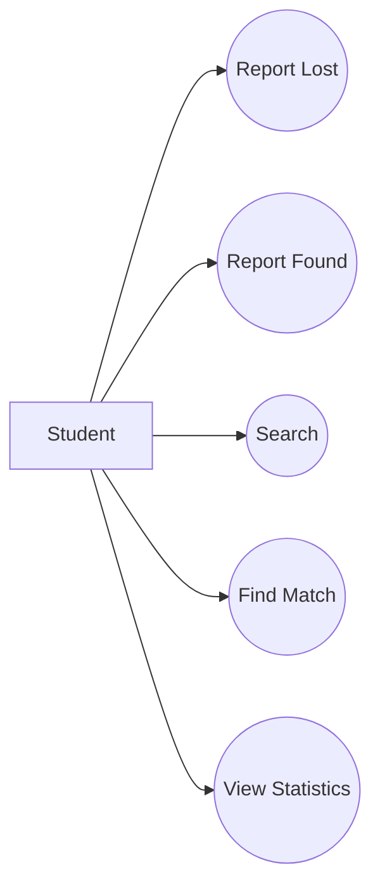
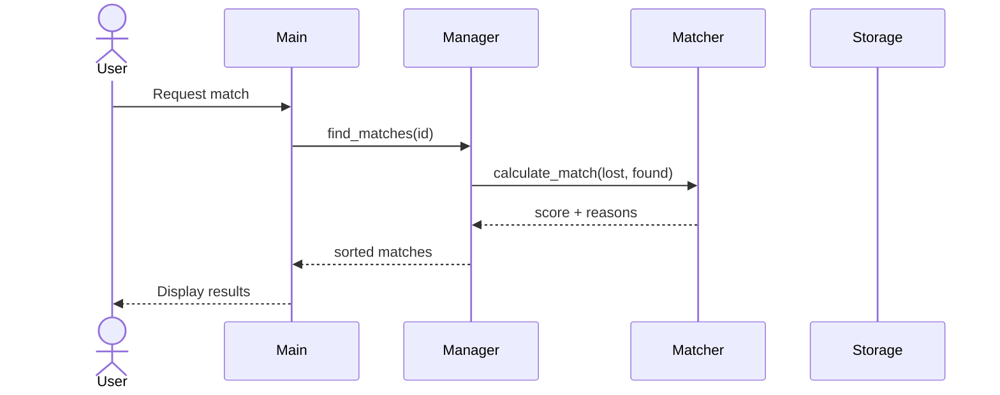

# CampusFind Diagrams

## Architecture

```mermaid
flowchart TD
    U[User] --> M[main.py]
    M --> TM[task_manager.py]
    TM --> MM[matching.py]
    TM --> MD[models.py]
    TM --> ST[storage.py]
    M --> V[validators.py]
    ST --> J[(items.json)]
```

## Workflow

```mermaid
flowchart TD
    A[Start] --> B{Choose Operation}
    B --> C[Report Lost]
    B --> D[Report Found]
    B --> E[Search]
    B --> F[Find Matches]
    B --> G[Statistics]
    C --> H[Validate and Save]
    D --> H
    E --> I[Filter and Display]
    F --> J[Calculate Match Score]
    G --> K[Calculate Statistics]
    H --> L[Continue]
    I --> L
    J --> L
    K --> L
    L --> B
```

## Use Case

```mermaid
flowchart LR
    S[Student] --> A((Report Lost))
    S --> B((Report Found))
    S --> C((Search))
    S --> D((Find Match))
    S --> E((View Statistics))
```

## Sequence

```mermaid
sequenceDiagram
    actor User
    participant Main
    participant Manager
    participant Matcher
    participant Storage

    User->>Main: Request match
    Main->>Manager: find_matches(id)
    Manager->>Matcher: calculate_match(lost, found)
    Matcher-->>Manager: score + reasons
    Manager-->>Main: sorted matches
    Main-->>User: Display results
```
